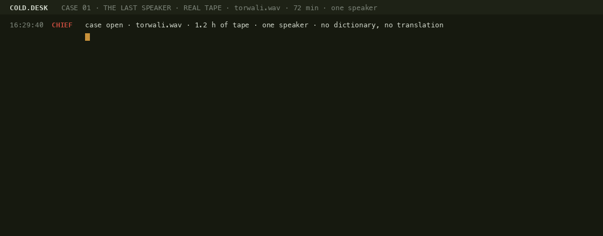

# COLD.DESK

**3,218 word candidates and 19 grammar rules out of 72 minutes of a language that has no
writing system.** no dictionary. no translation. no idea what any of it means.

six agents listen to raw tape of one speaker and pull out the sound inventory, the chains
that keep coming back, and the patterns that behave like grammar. every finding carries a
position on the tape, so you can go to that second and hear it yourself.

case 01 is called **the last speaker**: one man, one language, and no second speaker anywhere
to check the answers against.

nothing gets written without a source. the gate refused 41 of the 60 rules and says why
for each one.



**live report - every number opens that second of the recording:**
[torwali](https://jugqdc-sudo.github.io/cold-desk/) · [piedmontese](https://jugqdc-sudo.github.io/cold-desk/piedmontese.html)

```bash
pip install -r requirements.txt
python3 desk.py run data/tape.wav --name mytape     # ~1 min of cpu per hour of tape
python3 tests/test_desk.py                          # 5 checks, no models, under a second
```

## one desk, two languages

same code, two tapes from [Wikitongues](https://wikitongues.org) (CC BY), one speaker each.

| | Torwali · Swat valley, Pakistan | Piedmontese · Italy |
|---|---|---|
| tape | 72 min, 55.9 min of speech | 27 min, 24.9 min of speech |
| utterances cut by SCOUT | 1,164 | 292 |
| phones heard by PHON | 33,877 | 13,134 |
| sounds, narrow | 115 | 102 |
| core inventory (≥0.5% of the tape) | 45 sounds, 13 vowels | 39 sounds, 11 vowels |
| the vowel he uses most | **ɒ** ×3,353 | **a** ×1,623 |
| word candidates saved by LEX | 3,218 | 1,184 |
| heard exactly once | 1,316 | 628 |
| rules written → signed by CHIEF | 60 → 19 | 18 → 1 |
| fights open (two answers) | 9 | 0 |
| not his usual voice (register shifts) | 60 | 16 |
| speakers on the tape | 1 | 1 |

the vowel chart flips between the two tapes. the desk hears the language, not itself.
27 minutes is not enough tape for the gate: it refused 17 of 18 Piedmontese rules for being
heard fewer than 6 times. that is the gate working, not the language being empty.

sources: [Abdul Mateen speaking Torwali](https://www.youtube.com/watch?v=361y-JDT_bs) ·
[Giorgio speaking Piedmontese](https://www.youtube.com/watch?v=kKg2gaNzBK4)

## hear what it is pointing at

- [`samples/torwali_3845_not_his_usual_voice.mp3`](samples/torwali_3845_not_his_usual_voice.mp3) - the loudest
  register shift on the Torwali tape, [38:45](https://www.youtube.com/watch?v=361y-JDT_bs&t=2325s):
  332 Hz against his median 153 Hz. the crew does not know what it is. it only knows it is not
  the voice he uses for the other 1,100 utterances.
- [`samples/torwali_0218_rule_3_oxo.mp3`](samples/torwali_0218_rule_3_oxo.mp3) - rule 3, the ending `ɒ x ɒ`,
  one of the 10 places it comes back.

full reports with every tape position: [`runs/torwali/report.md`](runs/torwali/report.md) ·
[`runs/piedmontese/report.md`](runs/piedmontese/report.md)

## the crew

```
SCOUT   owns the tapes, the cuts         silero-vad · cuts speech into utterances with timestamps
PHON    owns the sounds, the vowel chart  allosaurus · phones from raw audio, no language model
LEX     owns the words, counts of one    a word is a chain of phones that comes back (≥3×, in ≥3 utterances)
GRAM    owns the rules, the exceptions   a rule is a chain that keeps attaching to different neighbours;
                                         a fight is two rules one phone apart that both come back
VOICE   owns how he sounds               praat · pitch and tempo per utterance; 2σ off = not his usual voice
CHIEF   runs the case                    the gate: no tape position → no. heard < 6 times → no.
                                         lives only in a shifted register → no, that is somebody else's voice
SCRIBE  owns the log                     log.txt · run.json · report.md
```

## run it on your own tape

```bash
python3 -m venv .venv && source .venv/bin/activate
pip install torch --index-url https://download.pytorch.org/whl/cpu
pip install -r requirements.txt

# reproduce the numbers above: the exact two tapes, straight off wikitongues
yt-dlp -x --audio-format wav -o data/torwali.%(ext)s     "https://www.youtube.com/watch?v=361y-JDT_bs"
yt-dlp -x --audio-format wav -o data/piedmontese.%(ext)s "https://www.youtube.com/watch?v=kKg2gaNzBK4"
ffmpeg -i data/torwali.wav -ac 1 -ar 16000 data/tape.wav   # mono 16 kHz is what SCOUT expects

python3 desk.py run data/tape.wav --name yourname --title "..." --url "https://youtube.com/watch?v=..."
python3 desk.py run data/tape.wav --name yourname --reuse     # everything after PHON, in seconds
python3 desk.py voice data/tape.wav                          # just: where is he not using his usual voice
python3 make_site.py yourname                                # docs/index.html with clickable tape positions
```
72 minutes of tape take about a minute on a laptop cpu. `--limit-min 3` for a smoke test - on three
minutes you will get sounds and a few words but zero rules, because the gate wants a pattern back
at least six times. that is the gate working, not the code failing.

## check it without downloading models

the heavy parts need models and a tape. the logic every number rests on does not:

```bash
python3 tests/test_desk.py
```

five checks, no dependencies, under a second: a phoneme keeps its skeleton when length and
aspiration are stripped, an affricate is never cut in half, a fight is two forms exactly one
phone apart, a chain heard once never becomes a word, and the gate refuses a rule with thin
support and says why. if any of those break, every table above is wrong.

full run needs `pip install -r requirements.txt` - versions pinned to the ones the numbers
came out of.

## what this is not

- it is not a translator and it does not know the language. every "word" is a chain that repeats,
  every "rule" is a chain that attaches to many different neighbours. a linguist would call
  most of this a starting point, and that is what it is.
- narrow transcription comes from a universal phone recognizer and is noisy. that is why LEX
  matches on the broad skeleton (diacritics, length and aspiration stripped) and PHON keeps the
  narrow inventory separately.
- the register shift detector hears pitch and tempo, not meaning. it flags where the speaker
  is not using his usual voice. whether that is a quote, a joke, a song or a child's line is
  for a human with ears and the tape position.

## the serial, day by day, against the code

the serial runs on @ventry089 with an invented speaker. the desk is not invented. this table
says exactly which part of each day exists as code you can run, and which part needs a living
speaker in the room - because some of it does, and pretending otherwise would be the same
mistake the desk itself refuses to make.

| day | what happens in the serial | in this repo |
|---|---|---|
| 1 | six agents pull sounds, words and rules off raw tape | `desk.py run` - SCOUT, PHON, LEX, GRAM, CHIEF, SCRIBE. 3,218 words and 60 rules out of 72 minutes |
| 2 | contradictions are kept as variants instead of being resolved | `fights` in [`runs/torwali/run.json`](runs/torwali/run.json) - 9 pairs one phone apart, both kept, neither picked |
| 3 | rules turn out to be him doing somebody else's voice | **done.** every rule carries `in_shifted_voice`. on this tape **6 of the 19 signed rules** only show up where his pitch or tempo is 2σ off his own median |
| 4 | the desk speaks the language back to him | the sentence assembly is not written yet. voice cloning off 45 h of one speaker is a solved problem, the reaction of a native speaker is not |
| 5 | the returned words come back 40 ms slower | per-utterance pitch and tempo are already measured (`voice.shifts`); comparing the same word across two dates is one script away and not written yet |

what the desk will never do: judge whether a rule is a joke, hear that a word belongs to
somebody's mother, or decide that a pattern is dead. those need the speaker. the gate exists
exactly because the desk cannot do them.

## why it exists

half the languages alive today have no written form, and most of them have fewer speakers
every year. when the last one goes, what is left is hours of audio nobody can read.

this is a first pass at reading it: not translation, but structure - what sounds exist, which
chains repeat, which patterns behave like grammar, and where the speaker stops sounding like
himself. a linguist would call it a starting point. that is exactly what it is, and it takes
about a minute of laptop cpu per hour of tape.

it started as the desk from the @ventry089 serial. the tape is real, the numbers came out of
it on 2026-09-04, and every one of them links to the second it came from.

MIT. tapes are CC BY, Wikitongues and the speakers.
